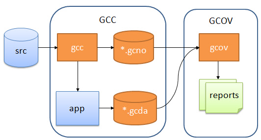

# Gcov Example

**Use [Gcov](https://gcc.gnu.org/onlinedocs/gcc/Gcov.html) + [LCOV](http://ltp.sourceforge.net/coverage/lcov.php) / [gcovr](https://github.com/gcovr/gcovr) to show C/C++ projects code coverage results.**

[](https://github.com/shenxianpeng/gcov-example/actions/workflows/pages/pages-build-deployment) [](https://github.com/shenxianpeng/gcov-example/actions/workflows/build.yml)

This repo shows how Gcov works and use Gcov and lcov/gcovr to show code coverage result for C/C++ projects.

* 📄 [LCOV - code coverage report](https://shenxianpeng.github.io/gcov-example/lcov-report/index.html)
* 📄 [gcovr - code coverage report](https://shenxianpeng.github.io/gcov-example/gcovr-report/coverage.html)
* 🏗️ [Build process](https://github.com/shenxianpeng/gcov-example/actions/workflows/build.yml)

Note: The source code is under the `master` branch, and code coverage report under branch `coverage`.

## Problem

The problem I encountered: A C/C++ project from decades ago has no unit tests, only regression tests. But I want to know:

* What code is tested by regression tests? 
* Which code is untested?
* What is the code coverage? 
* Where do I need to improve automated test cases in the future?

Can code coverage be measured without unit tests? The answer is Yes.

## C/C++ code coverage tools

There are some tools on the market that can measure the code coverage of black-box testing, such as Squish Coco, Bullseye, Gcov etc. 

Their principle is to insert instrumentation during build.

I've researched on [Squish Coco](https://shenxianpeng.github.io/2019/05/squishcoco/), but I didn't buy a license for this expensive tool due to some unresolved compilation issues.

## How Gcov works

Gcov workflow diagram



There are three main steps:

1. Adding special compile options to the GCC compilation to generate the executable, and `*.gcno`.
2. Running (testing) the generated executable, which generates the `*.gcda` data file.
3. With `*.gcno` and `*.gcda`, generate the `gcov` file from the source code, and finally generate the code coverage report.

Here's how each of these steps is done exactly.

### 1. Compile

The first step is to compile. The parameters and files used for compilation are already written in the `makefile`.

```bash
make build
```

<details>
<summary>Click to see the output of make build</summary>

```bash
sh-4.2$ make build
gcc -fPIC -fprofile-arcs -ftest-coverage -c -Wall -Werror main.c
gcc -fPIC -fprofile-arcs -ftest-coverage -c -Wall -Werror foo.c
gcc -fPIC -fprofile-arcs -ftest-coverage -o main main.o foo.o
```
</details>

As you can see from the output, this program is compiled with two compile options `-fprofile-arcs` and `-ftest-coverage`. 
After successful compilation, not only the `main` and `.o` files are generated, but also two `.gcno` files are generated.

> The `.gcno` record file is generated after adding the GCC compile option `-ftest-coverage`, which contains information 
for reconstructing the base block map and assigning source line numbers to blocks during the compilation process.

### 2. Run executable

After compilation, the executable `main` is generated, which is run (tested) as follows

```bash
./main
```

<details>
<summary>Click to see the output when running main</summary>

```bash
sh-4.2$ ./main
Start calling foo() ...
when num is equal to 1...
when num is equal to 2...
```

</details>

When `main` is run, the results are recorded in the `.gcda` data file, and if you look in the current directory, 
you can see that two `.gcda` files have been generated.

```bash
$ ls *.gcda
foo.gcda  main.gcda
```

> `.gcda` record data files are generated because the program is compiled with the `-fprofile-arcs` option introduced. 
It contains arc transition counts, value distribution counts, and some summary information.

### 3. Generate reports

You could generate lcov or gcovr reports.

```bash
make lcov-report
```

<details>
<summary> Click to see the output of make lcov-report </summary>

```bash
$ make lcov-report
gcov main.c foo.c
File 'main.c'
Lines executed:100.00% of 5
Creating 'main.c.gcov'

File 'foo.c'
Lines executed:85.71% of 7
Creating 'foo.c.gcov'

mkdir lcov-report
lcov --capture --directory . --output-file lcov-report/coverage.info
Capturing coverage data from .
Found gcov version: 9.4.0
Using intermediate gcov format
Scanning . for .gcda files ...
Found 2 data files in .
Processing foo.gcda
Processing main.gcda
Finished .info-file creation
genhtml lcov-report/coverage.info --output-directory lcov-report
Reading data file lcov-report/coverage.info
Found 2 entries.
Found common filename prefix "/home/ubuntu"
Writing .css and .png files.
Generating output.
Processing file gcov-example/foo.c
Processing file gcov-example/main.c
Writing directory view page.
Overall coverage rate:
  lines......: 91.7% (11 of 12 lines)
  functions..: 100.0% (2 of 2 functions)
```
</details>


```bash
make lcov-report
```

<details>
<summary> Click to see the output of make lcov-report </summary>

```bash
$ make gcovr-report
gcov main.c foo.c
File 'main.c'
Lines executed:100.00% of 5
Creating 'main.c.gcov'

File 'foo.c'
Lines executed:85.71% of 7
Creating 'foo.c.gcov'

mkdir gcovr-report
gcovr --root . --html --html-details --output gcovr-report/coverage.html
```
</details>

Before making reports actually performs `make coverage` command.

<details>
<summary> Click to see the output of make coverage </summary>

```bash
$ make coverage
gcov main.c foo.c
File 'main.c'
Lines executed:100.00% of 5
Creating 'main.c.gcov'

File 'foo.c'
Lines executed:85.71% of 7
Creating 'foo.c.gcov'
```
</details>


### Delete all generated files

All the generated files can be removed by executing `make clean` command.

<details>
<summary> Click to see the output of the make clean command </summary>

```bash
$ make clean
rm -rf main *.o *.so *.gcno *.gcda *.gcov lcov-report gcovr-report
```
</details>

## Code coverage reports

* Latest lcov online report: https://shenxianpeng.github.io/gcov-example/lcov-report/index.html
* Latest gcovr online report: https://shenxianpeng.github.io/gcov-example/gcovr-report/coverage.html

