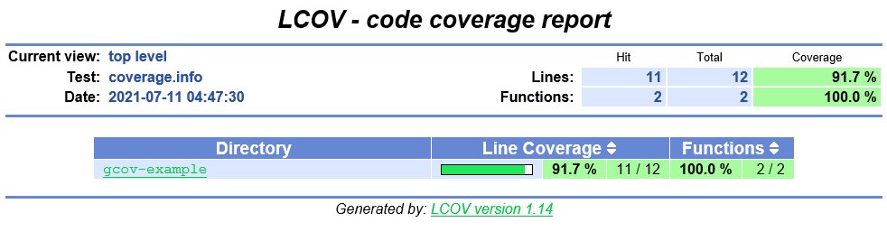
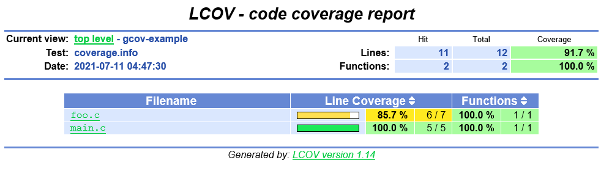
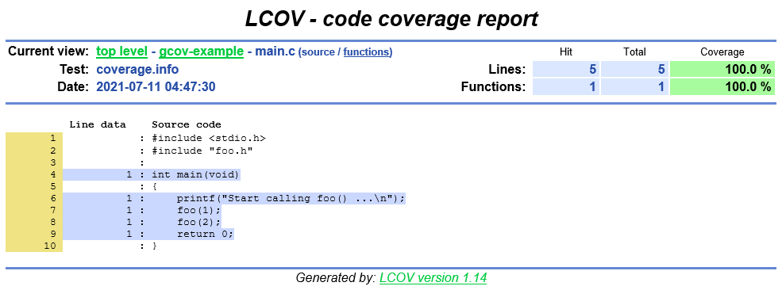
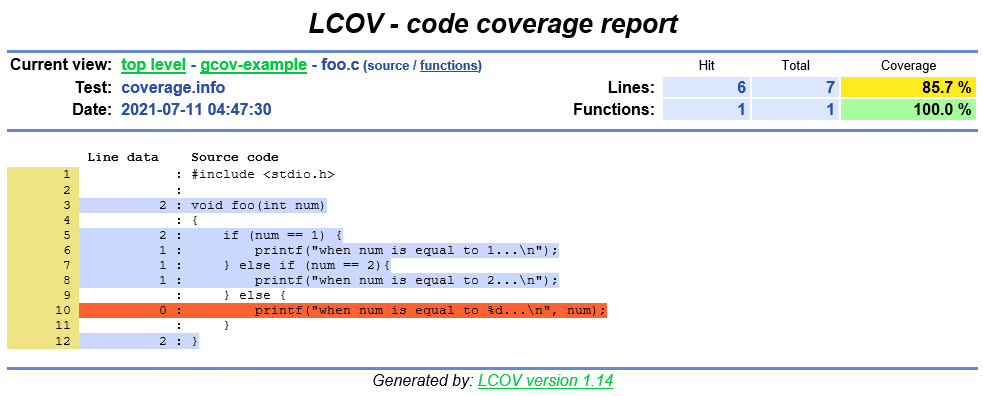

# Use Gcov and LCOV to perform code coverage testing on C/C++ projects

## Question

How can you do when your C/C++ project does not have unit test code, but you want to do code coverage testing?

There are some tools for C/C++ project code coverage testing in the market, but most are paid software, like Squish Coco, Bullseye, etc.

I learned [Squish Coco](https://shenxianpeng.github.io/2019/05/squishcoco/) a long time ago, as there are still some compilation problems not fixed, so I didn't purchase that one.

When I started the work on code coverage testing of C/C++ projects again, I just knew that GCC originally had code coverage compilation options `-fprofile-arcs` and `-ftest-coverage`. To figure out how [Gcov](https://gcc.gnu.org/onlinedocs/gcc/Gcov.html) works, I did some investigations, and please refer to the following steps to see how it works.

## Precondition

If you want to run this demo program of this repository, you need to install [GCC](https://gcc.gnu.org/install/index.html) and [lcov](http://ltp.sourceforge.net/coverage/lcov.php) first.

```bash
# The versions of GCC and lcov in my environment.
sh-4.2$ gcc --version
gcc (GCC) 4.8.5 20150623 (Red Hat 4.8.5-39)
Copyright (C) 2015 Free Software Foundation, Inc.
This is free software; see the source for copying conditions.  There is NO
warranty; not even for MERCHANTABILITY or FITNESS FOR A PARTICULAR PURPOSE.

sh-4.2$ lcov -v
lcov: LCOV version 1.14
```

## How to run

### 1. Compile

```bash
make
```

<details>
<summary> click to expand the output of make</summary>

```bash
sh-4.2$ make
gcc -fPIC -fprofile-arcs -ftest-coverage -c -Wall -Werror main.c
gcc -fPIC -fprofile-arcs -ftest-coverage -c -Wall -Werror foo.c
gcc -fPIC -fprofile-arcs -ftest-coverage -o main main.o foo.o
```
</details>

The program is built with these two options `-fprofile-arcs` and `-ftest-coverage`. After compilation, not only generated `main` and `.o` files, but also two `.gcno` files.

> The `.gcno` notes file is generated by adding GCC `-ftest-coverage` option to the source file when running `make`, it contains information to reconstruct the basic block graphs and assign source line numbers to blocks.

### 2. Run executable

```bash
./main
```

<details>
<summary> click to expand the output of running main</summary>

```bash
sh-4.2$ ./main 
Start calling foo() ...
when num is equal to 1...
when num is equal to 2...
```

</details>

After running the executable file `main`, the result is recorded in the `.gcda` count data file. In this case, there are two `.gcda` files are generated.

```bash 
$ ls
foo.c  foo.gcda  foo.gcno  foo.h  foo.o  img  main  main.c  main.gcda  main.gcno  main.o  makefile  README.md
```
> The `.gcda` count data file is generated when a program containing object files built with the GCC `-fprofile-arcs` option is executed. A separate `.gcda` file is created for each object file compiled with this option. It contains arc transition counts, value profile counts, and some summary information.

### 3. Generate report

```bash
make report
```

<details>
<summary> click to expand the output of make report</summary>

```bash
sh-4.2$ make report
gcov main.c foo.c
File 'main.c'
Lines executed:100.00% of 5
Creating 'main.c.gcov'

File 'foo.c'
Lines executed:85.71% of 7
Creating 'foo.c.gcov'

Lines executed:91.67% of 12
lcov --capture --directory . --output-file coverage.info
Capturing coverage data from .
Found gcov version: 4.8.5
Scanning . for .gcda files ...
Found 2 data files in .
Processing foo.gcda
geninfo: WARNING: cannot find an entry for main.c.gcov in .gcno file, skipping file!
Processing main.gcda
Finished .info-file creation
genhtml coverage.info --output-directory out
Reading data file coverage.info
Found 2 entries.
Found common filename prefix "/workspace/coco"
Writing .css and .png files.
Generating output.
Processing file gcov-example/main.c
Processing file gcov-example/foo.c
Writing directory view page.
Overall coverage rate:
  lines......: 91.7% (11 of 12 lines)
  functions..: 100.0% (2 of 2 functions)
```
</details>

Finally, execute `make report` to generate the HTML report, which does the following things:

First, generate `.gcov` file

When the two files `.gcno` and `.gcda` were created, the report file can be generated by the `gcov` command, `.gcov` file is generated when running `gcov main.c foo.c` command.

Second, generate HTML report

Although the above output can know the code coverage of the two source files `main.c` and `foo.c`, but it is not visualized. 

We need a tool that can visualize the results, `LCOV` is a tool that can help us generate more intuitive HTML reports.

1. `lcov --capture --directory . --output-file coverage.info` command to generate coverage.info data file.

2. `genhtml coverage.info --output-directory out` to generate HTML report.

> LCOV is a graphical front-end for GCC's coverage testing tool gcov. It collects gcov data for multiple source files and creates HTML pages containing the source code annotated with coverage information. It also adds overview pages for easy navigation within the file structure. LCOV supports statement, function and branch coverage measurement.

### 4. Delete all generate files

```bash
make clean
```

<details>
<summary> click to expand the output of make clean</summary>

```bash
sh-4.2$ make clean
rm -rf main *.o *.so *.gcno *.gcda *.gcov coverage.info out
```
</details>

## Code coverage report









Note: git checkout to `coverage` branch, under `out` directory to view or download the HTML report.

> The `master` branch only saves source files such as `.c`, `.h`, and `makefile` only to be used for demonstration. \
> The `coverage` branch saves all the files generated during the demonstration process, as well as the final code coverage HTML report file (under the `out` directory).

## Reference

Some helpful documents links about this research:

* Gcov homepage: https://gcc.gnu.org/onlinedocs/gcc/Gcov.html
* Lcov homepage: http://ltp.sourceforge.net/coverage/lcov.php

* gcovr homepage: https://github.com/gcovr/gcovr （Another HTML report generation tool implemented in Python, the report display is slightly different from Lcov.)

* Gcov Data File Relocation to Support Cross-Profiling
    * https://gcc.gnu.org/onlinedocs/gcc/Cross-profiling.html#Cross-profiling
    * https://stackoverflow.com/questions/7671612/crossprofiling-with-gcov-but-gcov-prefix-and-gcov-prefix-strip-is-ignored

* Using gcov with the Linux kernel: https://01.org/linuxgraphics/gfx-docs/drm/dev-tools/gcov.html
